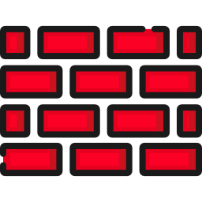

## Overview
"Wall" is a simple social portal base on [Laravel 5.4](https://laravel.com/). Where users can:
- publish post with tags
- set like or dislike for posts
- search another users or posts
- subscribe on friends
- watch top of posts
- watch posts him subscriptions
- make online video conference

## Requirements
- [PHP 7.0+](http://php.net/)
- [PostgreSQL 9.5.6](https://www.postgresql.org/)
- [Redis 3.2](https://redis.io/)
- [Laravel Echo Server](https://github.com/tlaverdure/laravel-echo-server)
- [Node.js 6.10+](https://nodejs.org/en/)
- [Composer](https://getcomposer.org/)

## Getting started
- [Configuration Laravel](https://laravel.com/docs/5.4/installation#configuration)
- [Install](https://getcomposer.org/doc/01-basic-usage.md#installing-dependencies) php dependencies `sudo composer install`
- [Run migration](https://laravel.com/docs/5.4/migrations#running-migrations) `php artisan migrate`
- [Add link](https://laravel.com/docs/5.4/filesystem#the-public-disk) to storage directory `php artisan storage:link`
- [Install](https://docs.npmjs.com/cli/install) js/css dependencies `sudo npm install`
- [Run script](https://docs.npmjs.com/cli/run-script) to build js/css files `sudo npm run production`
- Install [Laravel Echo Server](https://github.com/tlaverdure/laravel-echo-server) ,then init it and run.

You can use [seeds](https://laravel.com/docs/5.4/seeding#running-seeders) for seeding your database with test data, after that you can use default account

> Login: `admin@gmail.com`

> Password: `admin`

Also all default users, except admin, have password `secret`

---

For use all site's abilities like **html5 notification** or **WebRTC conference** , you must use [https](https://en.wikipedia.org/wiki/HTTPS) for site and Laravel Echo Server

At the moment audio/video **conferences** work only in Google Chrome
